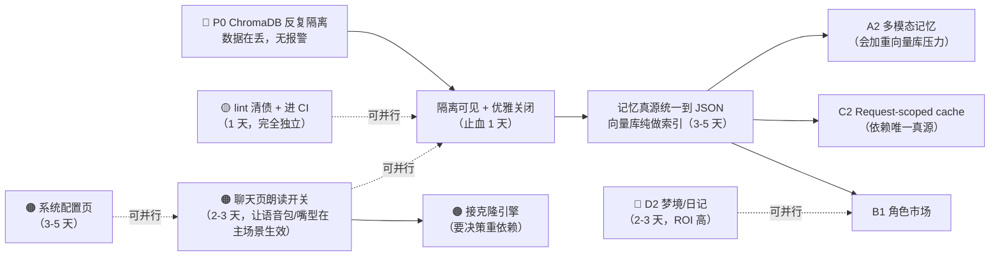

# 系统推进方案（优先级与依赖）

> 编写于 2026-09-18，基于 master `7f6df32` 的**实测**现状，不是照抄旧文档。
> 旧 `ROADMAP.md` 写于 2026-06-22，其中已完成项已归档，本文件是它的后续。

**本文件在同目录里的位置**：`plans/` 下的其他文档（`2026-07-17-clear-p0-tech-debt.md` 等）
都是**单件事的执行计划** —— 有 Goal / File Structure / 逐 Task 的 checkbox 步骤。
本文不同，它是**选哪些事做、按什么顺序做**的那一层，覆盖整个系统。
**选定其中一项后**，再按同目录的格式单独写一份执行计划（含基线、文件清单、逐步 checkbox）。

**状态标记**：🔴 P0 有真实数据风险 / 🟠 P1 已投入但没闭环 / 🟡 P2 工程债 / 🔵 P3 产品方向

---

## 0. 这份方案的依据

所有结论都来自实测，每条都带证据。几处与旧文档不一致的地方，以本文为准：

| 旧文档说法 | 实测结果 |
|---|---|
| 「前端 lint 债：`VRMAvatar.vue` 12 处、`CharactersView.vue` 1 处」 | **已过时**。当前 30 个 error，且集中在测试文件（`LipSyncEngine.test.ts` 12、`LipSyncEngine.spec.ts` 9），两个 `.vue` 都干净了 |
| 「ChromaDB 损坏备份清理 30m，P1」 | 不是一次性清理问题 —— **它今天 1.5 小时内又新增了 5 个**，是活跃的数据风险，见 §1 |
| 「P0 后台 tick 进行中」 | 已完成（`world_tick_scheduler.py` 在跑） |

---

## 1. 🔴 P0：ChromaDB 反复被隔离，RAG 记忆被静默清空

**这是当前最该先处理的一件事**，因为它是**真实数据在丢**，而且**没有任何报警**。

### 证据

`backend/data/` 下实测有 **6 个 `chroma_corrupt_*` 隔离目录**，时间戳：

```
2026-07-10 17:36      （1 个，旧）
2026-09-18 16:10      ┐
2026-09-18 16:28      │
2026-09-18 16:40      ├ 5 个，全部集中在 1 小时 20 分钟内
2026-09-18 17:10      │
2026-09-18 17:29      ┘
```

每个目录里都有一个**真实大小的 `chroma.sqlite3`**（823KB → 1.3MB → 1.5MB → 1.6MB，
尺寸随当天递增 = 重建后又同步数据、再被扔掉）。合计约 **9.8MB 被隔离的向量库**。

### 影响

`memory_rag._quarantine_corrupt_dir()` 的日志自己写明了后果：

> long_memory/events/chat_summary 等**仅存向量库**的数据会丢失，
> profile/story/relationship 会在下次 /chat 时从 JSON 重新同步。

也就是：**长期记忆、事件、聊天摘要会被清空**，而用户端**看不到任何异常** ——
接口不报错、角色照常回复，只是"忘了"。

### 为什么一直没被发现

自愈逻辑设计得很好（隔离 + 重建 + 不抛 500），但它同时**把故障藏了起来**：
只有一行 `logger.warning`，没有堆栈、没有计数、没有上报。
「自愈成功」和「数据丢失」被合并成了同一种表现。

### 待查方向（按可能性排序）

1. **非优雅退出**：今天 5 次隔离都发生在我反复启停后端的时段（`TaskStop` 强杀）。
   SQLite 被 SIGKILL 打断可能留下不一致状态。**但需要验证生产环境是否会触发** ——
   Docker 的 `docker compose down` / 容器 OOM 都算非优雅退出。
2. **并发写**：`world_tick_scheduler` 后台循环和请求处理可能同时写向量库。
   代码里第 255 行有一个 `runtime error` 分支也会触发隔离，说明**运行时**就会失败，不只是启动时。
3. **目录被占用**：已经出现过一次 `move 失败 → 退到 chroma_new`（`data/chroma_new` 就是证据），
   Windows 文件锁会让隔离本身也不干净。

### 建议动作

| # | 动作 | 为什么 | 工作量 |
|---|---|---|---|
| 1 | **隔离事件必须可见**：加计数 + 上报（日志带堆栈、暴露到 `/health` 或监控） | 「数据丢了但没人知道」是最糟的失败模式，先让它可见 | 2h |
| 2 | 复现并抓到真实异常栈（现在只有 `reason` 字符串，没有 traceback） | 没有堆栈就只能猜 | 4h |
| 3 | **lifespan shutdown 里显式关闭 ChromaDB 客户端** | 优雅退出是成本最低的一层防护 | 2h |
| 4 | **根治：让「只存向量库」的数据变成可重建** | 只要还有一类数据只活在向量库里，隔离就等于永久丢失。让 JSON 成为唯一真源、向量库纯做索引 —— 隔离退化成"重建索引"，不再是数据事故 | 3-5 天 |
| 5 | 清理 9.8MB 残留目录 | 但**先留作证据**，等第 2 步抓完栈再删 | 30m |

> 第 4 条是真正的解法。前三条是止血，第 4 条才让它不可能再成为事故。

---

## 2. 🟠 P1：把已经投入但没闭环的能力接完

这几项都是**成本已经付了大半**，差最后一截就能用。

### 2.1 语音包只接通了"半条链路"

**现状**：TTS 只存在于语音通话（`conversation_manager.process_tts_queue`）。
用户在**聊天页打字，永远听不到角色的声音** —— 而这才是主场景。

刚做完的语音包（音色/语速/参考音频/每角色绑定）在文本聊天里**完全用不上**。

**建议**：聊天页加「朗读」开关（逐条 / 自动），复用现成的 `voice_service.synthesize_speech` +
前端已有的 `playTtsAudio()` + `subscribeTtsLipSync()`（3D 嘴型也顺带活了）。
工作量约 **2-3 天**，但能让语音包、3D 嘴型、lip-sync 三块已完成的投入**同时在主场景生效**。

### 2.2 音色克隆引擎没接

参考音频的上传、存储、参考文本、UI「引擎未部署」标记**全部就位**，
`engine: 'clone'` 的分支也已经存在（会明确报"未部署"而不是静默降级）。

**要决策的是重依赖**：XTTS-v2 / CosyVoice 需要 torch + GB 级权重，CPU 上每句约 1-3 秒。
接入本身只是新增一个 `_synth_clone()` 适配器 + 装依赖，**前端和存储一行都不用改**。

### 2.3 系统配置页其实不存在

`/admin` 目前只有**用户审批 + 配额**。所有 TTS / 嵌入 / 模型上限配置都是 `.env`：

```
TTS_PROVIDER / VOICE_NAME / SPEAKING_RATE / PITCH / VOLUME
EMBEDDING_PROVIDER / MODEL_MAX_MB ...
```

改任何一项都要**改文件 + 重启进程**。

**建议**：语音包已经落在设置页了，顺势把「全局默认音色」「上传体积上限」这类
运行时可改的配置收进一个真正的「系统配置」区（仍然是仅管理员）。
工作量 **3-5 天**。

### 2.4 3D 的收尾

- **glTF AnimationClip 播放**：现在只支持 VRM 的程序化动画，带骨骼动画的 glTF 模型动不起来
- **模型文件 CDN 化**：17MB 的 VRM 直接由后端静态托管，用户多起来会顶满带宽

---

## 3. 🟡 P2：工程债（都有实测依据）

### 3.1 lint 没进 CI

`package.json` 里有 `lint:oxlint` / `lint:eslint`，但 `.github/workflows/ci.yml` **没有跑它们**。

实测当前 **30 个 error**，分布：

```
src/components/3d/LipSyncEngine.test.ts        12
src/components/3d/__tests__/LipSyncEngine.spec.ts  9
src/views/__tests__/StoryView.spec.ts           2
src/api/__tests__/character-model.spec.ts       2
src/stores/chatStore.ts                         1
src/api/request.ts                              1
src/api/__tests__/story.spec.ts                 1
```

**关键观察**：**26/30 集中在测试文件**，而且 `LipSyncEngine` 有两个测试文件（`.test.ts` + `.spec.ts`）
内容重复 —— 这是同一件事的两个信号：测试代码没人管。

**建议**：先清掉这 30 个（多数是 `vi.fn()` 缺类型参数这类机械修复），
顺手合并那两个重复的 LipSyncEngine 测试文件，**再把 lint 加成 CI 阻断门**。
工作量 **1 天**。

### 3.2 磁盘没有清理策略

`backend/data/` 实测：chroma 残留 9.8MB + `chroma_new` 184KB。
`data/` 被 .gitignore，所以没人会注意到它一直在长。

**建议**：随 §1-4 一起做 —— 一旦向量库变成可重建，就能安全地加一个"启动时清理 30 天前的隔离目录"。

### 3.3 首屏体积

`VRMAvatar` chunk **844KB**（three.js + three-vrm），是第二大 chunk（120KB）的 7 倍。
已经是懒加载，但用户一进聊天页就会拉。

**建议**：先不动（功能优先）。如果要做，方向是 three.js 按需引入 + 模型文件 CDN 化。

### 3.4 Request-scoped cache（旧文档 C2，一直没做）

一次 `/chat` 会把同一个记忆文件 `load → 改 → save` 8-10 次。
在 §1-4 把记忆真源统一到 JSON 之后做这件事会更安全（否则缓存和"唯一真源"两件事会互相干扰）。

---

## 4. 🔵 P3：产品方向（旧文档里仍未做的）

| 方向 | 内容 | 工作量 | 备注 |
|---|---|---|---|
| A2 多模态记忆 | 图片 → 视觉模型描述 → 入 RAG；语音备忘录 → STT | 1 周 | ROI 高，但会**加重 §1 的向量库压力**，建议排在 §1 之后 |
| B1 角色市场 | 发布 / 领养 / 评分 / 热度 | 2 周 | 从"自己玩"到"创作者经济"，需要审核流程 |
| B2 角色变体 | fork 角色 + LLM 改写人设 | 3-5 天 | 依赖 B1 的存储形态 |
| D2 梦境 / 日记 | 凌晨 LLM 睡前总结 → 次日主动说"我昨晚梦到…" | 2-3 天 | 复用 `chat_summary` + 主动消息，**ROI 很高** |
| D4 NPC 群聊旁观 | 让用户旁观 NPC 之间对话 | 1 周 | `interaction_agent` 已有关系数据 |
| D3 桌面挂件增强 | 系统托盘 / 开机自启 / 浏览器扩展 | 各 1-2 天 | MVP 已在跑 |
| C1 Postgres + pgvector | 用户表 + 记忆 JSONB + 向量库合一 | 1-2 周 | 等用户量上来。**顺带能解掉 §1 的并发写问题** |
| C3 计费 / C4 监控 | 套餐分级 / Sentry / 日志聚合 | 视用户量 | C4 里的"隔离事件上报"其实就是 §1-1 |

---

## 5. 建议的推进顺序



**如果只做一件事**：做 §1 的第 1、3、4 条。数据在丢而且没人知道，这比任何新功能都重要。

**如果要做一件"看起来有进展"的事**：§2.1 聊天页朗读开关 —— 它让语音包、3D 嘴型、
lip-sync 三块已完成的投入**同时在主场景生效**，用户能直接感知到。

---

## 6. 需要你拍板的三件事

1. **§1 的深度**：只做止血（1 天，隔离可见 + 优雅关闭），还是直接做根治（3-5 天，
   把记忆真源统一到 JSON）？我建议**先止血、尽快排根治** —— 止血只是让事故可见，
   不代表不再丢数据。
2. **克隆引擎要不要装**：这是**唯一一个需要重依赖**（torch + GB 级权重）的决定。
   不装的话语音包就停在"edge 固定音色"这一步（也能用，只是音色没法克隆）。
3. **系统配置页放哪**：现在语音包在 `/settings`（个人设置页）里，但它是**全局管理功能**，
   语义上更该在 `/admin`。要不要借这次机会把管理员功能统一挪到 `/admin`？

---

## 7. 已归档（旧 ROADMAP 的完成项，避免重复投入）

A1 后台 world tick ✅ / A3 多剧情 ✅ / A4 角色自我意识 ✅ / C5 CI + 测试 ✅ /
D1 3D 模型全链路 ✅ / D3 桌面挂件 MVP ✅

**本轮（2026-09-18）新增完成**：
3D 人物自然化 + 无框浮出 + 通话大立绘 + 程序化夜色背景 / 语音包（管理员全局库 + 每角色绑定）/
心情驱动表情 / 主题变量根因修复 / `current_event` 渲染修复 / 后端文件清理统一降级
